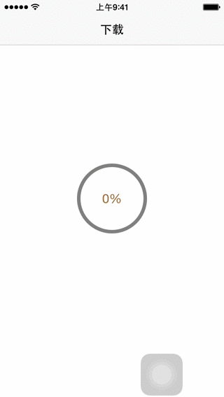

##网络

* 采用MKNetworkKit库
* 网络下载代码封装

```
MKNetworkOperation *operation = [[MKNetworkOperation alloc] initWithURLString:@"http://mr3.douban.com/201508152125/c7afbeeb3248c382aac7811330bb898c/view/song/small/p1469094_128k.mp4" params:nil httpMethod:@"Get"];
[operation addHeader:@"Range" withValue:[NSString stringWithFormat:@"bytes=%llu-", [self _getCacheFileSize:[self _savePath]]]];
[operation addDownloadStream:[NSOutputStream outputStreamToFileAtPath:[self _savePath] append:YES]];
__weak __typeof(self) weakSelf = self;
[operation onDownloadProgressChanged:^(double progress) {
    NSLog(@"%.2f", progress);
    
    [weakSelf.progressBtn setTitle:[NSString stringWithFormat:@"%.f%%", progress * 100] forState:UIControlStateNormal];
    [weakSelf.progressBtn setProgress:progress];
    if (progress == 1) {
        weakSelf.progressBtn.userInteractionEnabled = NO;
    }
}];
```

`[operation addHeader:@"Range" withValue:[NSString stringWithFormat:@"bytes=%llu-", [self _getCacheFileSize:[self _savePath]]]];`添加Range头部，获取已下载的文件的字节，断点续传

`[operation addDownloadStream:[NSOutputStream outputStreamToFileAtPath:[self _savePath] append:YES]];`字节流输出到_savePath路径，append:YES在字节尾部添加

`[operation onDownloadProgressChanged:^(double progress) {
    NSLog(@"%.2f", progress);
}];`下载进度更新block，可以在block里面更新UI

##进度条UI

* 封装CircularProgressButton

画圆方法

```
- (void)drawRect:(CGRect)rect
{
    [super drawRect:rect];
    //draw background circle
    UIBezierPath *backCircle = [UIBezierPath bezierPathWithArcCenter:CGPointMake(CGRectGetWidth(self.bounds) / 2, CGRectGetHeight(self.bounds) / 2)
                                                              radius:(CGRectGetWidth(self.bounds) - self.lineWidth ) / 2
                                                          startAngle:(CGFloat) - M_PI_2
                                                            endAngle:(CGFloat)(1.5 * M_PI)
                                                           clockwise:YES];
    [self.backColor setStroke];
    backCircle.lineWidth = self.lineWidth;
    [backCircle stroke];
    
    if (self.progress) {
        //draw progress circle
        UIBezierPath *progressCircle = [UIBezierPath bezierPathWithArcCenter:CGPointMake(CGRectGetWidth(self.bounds) / 2,CGRectGetHeight(self.bounds) / 2)
                                                                      radius:(CGRectGetWidth(self.bounds) - self.lineWidth ) / 2
                                                                  startAngle:(CGFloat) - M_PI_2
                                                                    endAngle:(CGFloat)(- M_PI_2 + self.progress * 2 * M_PI)
                                                                   clockwise:YES];
        [self.progressColor setStroke];
        progressCircle.lineWidth = self.lineWidth;
        [progressCircle stroke];
    }
}
```

更新进度

```
- (void)setProgress:(float)progress
{
    _progress = progress;
    [self setNeedsDisplay];
    [self setNeedsLayout];
    if (self.delegate && [self.delegate respondsToSelector:@selector(updateProgressViewWithProgress:)]) {
        [self.delegate updateProgressViewWithProgress:self.progress];
    }
}
```

初始化方法

```
- (id)initWithFrame:(CGRect)frame
          backGressColor:(UIColor *)backColor
      progressColor:(UIColor *)progressColor
          lineWidth:(CGFloat)lineWidth
{
    self = [super initWithFrame:frame];
    if (self) {
        _progressColor = progressColor;
        _lineWidth = lineWidth;
        _backColor = backColor;
    }
    return self;
}
```

* 使用进度条

```
CircularProgressButton *progressBtn = [[CircularProgressButton alloc] initWithFrame:CGRectMake(50, 100, 100, 100)
                                                                     backGressColor:[UIColor grayColor]
                                                                      progressColor:[UIColor greenColor]
                                                                          lineWidth:5.f];
[progressBtn setTitleColor:[UIColor brownColor] forState:UIControlStateNormal];
[progressBtn setTitle:[NSString stringWithFormat:@"%.f%%", 0.0 * 100] forState:UIControlStateNormal];
progressBtn.selected = NO;
[self.view addSubview:progressBtn];
self.progressBtn = progressBtn;

[progressBtn addTarget:self action:@selector(_downloadAction:) forControlEvents:UIControlEventTouchUpInside];
```